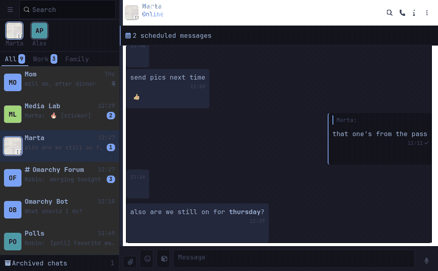
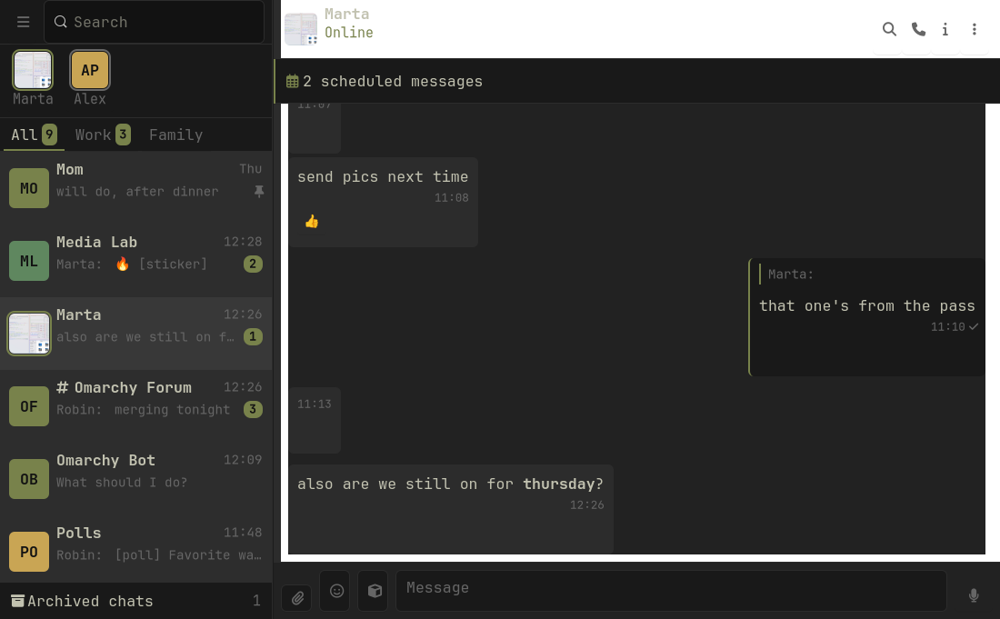
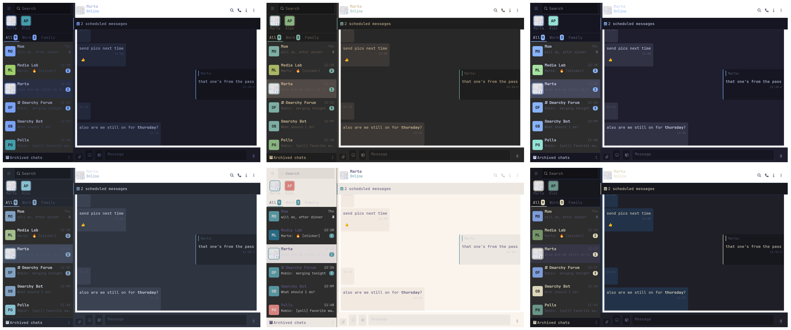

# Omarchygram

A Telegram client for Omarchy that takes its colors from the active Omarchy theme.



Switch your Omarchy theme and the client follows instantly — every bundled
theme, no restart. The clip also shows a few of the optional terminal-style
animations: the boot log, the typing indicator, typewriter message reveal with
phosphor burn-in, the chat-switch cascade, badge pops and scanlines.
([video](https://github.com/leonaffi-byte/omarchygram/releases/download/v0.1.0/omarchygram-demo.mp4))





Native GTK 4 in Rust — no Electron, no web view. Keyboard-first and dense,
closer to a terminal than to Telegram Desktop. Voice calls, inline media,
stickers and animated stickers, polls, topics, stories, a local AI assistant
over your own chats, anti-delete and edit history, Omarchy actions from a chat,
and 54 optional terminal-style animations.

## Install (Omarchy / Arch)

A prebuilt package is attached to each release:

```
sudo pacman -U https://github.com/leonaffi-byte/omarchygram/releases/download/v0.1.0/omarchygram-0.1.0-1-x86_64.pkg.tar.zst
```

It pulls in GTK 4, GStreamer (with the good and libav plugin sets), ffmpeg and
the JetBrainsMono Nerd Font, and adds an "Omarchygram" entry to the app menu.

To get updates with `pacman -Syu`, enable the project's package repository
instead (once):

```
sudo tee -a /etc/pacman.conf >/dev/null <<'EOF'

[omarchygram]
SigLevel = Optional
Server = https://github.com/leonaffi-byte/omarchygram/releases/latest/download
EOF
sudo pacman -Sy omarchygram
```

(`SigLevel = Optional` because the packages are not signed yet; they are built
from the tagged sources with `packaging/PKGBUILD`.) An AUR package
(`yay -S omarchygram`) follows once AUR account registration reopens.

## Requirements (building from source)

Arch Linux with:

```
sudo pacman -S --needed gtk4 rust
```

## Build and run

```
cargo build            # build
cargo run              # run against real Telegram (needs credentials, see below)
cargo run -- --smoke   # run offline against mock data, no login needed
cargo test             # run the tests
```

Use `--smoke` to look at the app without setting anything up.

## Telegram API credentials (one-time)

Real Telegram access needs your own API credentials. They are personal; never
commit them.

1. Log in at <https://my.telegram.org/apps> with your Telegram account.
2. Create an application (any name, platform "Desktop").
3. Start Omarchygram and enter the API ID and API hash in the form it shows
   (they are saved to a private file). Or write the file yourself:

   ```
   mkdir -p ~/.config/omarchygram
   (umask 077; cat > ~/.config/omarchygram/config.toml <<EOF
   api_id = <your api_id>
   api_hash = "<your api_hash>"
   EOF
   )
   ```

   (The `umask` makes the file private from the moment it is created.)

On the first `cargo run` the app asks for your phone number and the login code
Telegram sends you (and your password if you use two-step verification). The
session is stored at `~/.local/share/omarchygram/omarchygram.session`, so this
happens only once.

## Background operation and online status

Closing the window keeps Omarchygram running: messages, synchronization and
notifications continue without occupying a workspace. Launch it again to
restore the same window and chat. Disable this in **Settings → Messaging →
Keep running when the window closes** if you prefer closing to quit.

Use **☰ → Quit Omarchygram**, **Ctrl+Q**, or `omarchygram --quit` to stop it.
`omarchygram --background` starts with the window hidden; login still opens a
window when needed. This does not enable automatic startup at login.

Omarchygram reports online while its window is visible, focused and used within
the last five minutes. Hiding it, moving focus elsewhere or becoming idle
requests offline status. Ghost mode always requests offline. Telegram privacy
settings, network delays and your other Telegram clients can affect what
contacts see; a background connection alone does not request online status.

Recently opened chats display their cached messages immediately, then refresh
from Telegram. The account-specific cache keeps up to 24 recent pages of 50
messages each, at most 12 MiB of message payload. Cache files are private and
persist across restarts. A chat without cached history still needs its first
Telegram response. Failed refreshes keep the cached content and offer Retry.

## Profiles and media

Click a sender's name in a group to view their profile without leaving the
conversation. **Message** opens a private chat; **Call** starts a voice call
when calling support is enabled. Click a profile photo in these details or in
Chat info to view the larger photo. Escape returns to the details.

Photos and voice messages can recover their download details even when the
chat first opens from its local cache. Download and playback errors offer
**Retry**, which can replace a damaged cached file. Desktop message
notifications include the private chat's user photo or the group's photo;
notifications still arrive if a photo is unavailable or slow to download.

## Layout

Telegram Desktop's layout on the Omarchy skin: a resizable chat list (drag
the divider; `Ctrl+Shift+B` collapses it to an avatar strip; it collapses by
itself under 640px), a search box (chats, then messages) and the ☰ main menu
above it, folder tabs when your account has folders, an "Archived chats" row,
avatars (profile photos or initials in theme colors), a chat header with the
contact's status and a ⋮ menu (mute, pin, mark unread, jump to date, clear
history, delete chat), day separators, sender names in groups, inline
timestamps with ✓/✓✓ read ticks, and per-chat drafts that follow you between
chats and devices. Right-click a chat for the same actions.

## Messages

Search inside a chat (the magnifier in the header, `Ctrl+Shift+F`) with
"N of M" navigation; bold/italic/strike/code/links/spoilers render and can be
typed with the usual shortcuts or `**markers**`; link previews; reactions
(right-click a message for the quick row, click a pill to toggle); pinned
message bar with a four-line preview and Expand/Collapse; forward to one or several chats; full-window photo viewer with
arrow keys and Save/Open; video/GIF/audio cards that download and open in
your default app.

## More Telegram functions

The **i** button (or `Ctrl+Shift+I`) opens the chat info panel: photo, bio,
username, phone, notifications switch, members of a group, and the shared
photos/files/links/voice tabs. The sticker button next to the emoji one opens
your sticker packs and saved GIFs. The microphone records a voice note
(needs `ffmpeg`; Esc cancels). ☰ → Contacts opens a chat with a contact;
☰ → New group creates one. Right-click a message → Select for multi-select
(forward, delete, copy several at once). Attaching a file asks for a caption.
Muted chats never raise desktop notifications.

## Keyboard

| Key           | Action                          |
| ------------- | ------------------------------- |
| `Ctrl+K`      | Open the chat switcher          |
| `Alt+Up`      | Previous chat                   |
| `Alt+Down`    | Next chat                       |
| `Enter`       | Send the message                |
| `Shift+Enter` | New line in the message         |
| `Esc`         | Cancel, or focus the composer   |
| `Ctrl+,`      | Open settings                   |
| `Ctrl+F`      | Search chats and messages       |
| `Ctrl+Shift+B`| Collapse the chat list          |
| `Ctrl+B/I/U`  | Bold / italic / underline       |
| `Ctrl+Shift+X/M/K/P` | Strike / monospace / link / spoiler |

Every shortcut can be changed in Settings → Keyboard.

## Settings

`Ctrl+,` (or ☰ → Settings) opens the settings pages: Account, Appearance,
Timestamps, Privacy, AI, Omarchy, Keyboard, Animations. Every option writes
straight to `~/.config/omarchygram/settings.toml` (also hot-reloaded if you
edit the file by hand). Everything below is off until you turn it on.

- **Account** — who you are, "Change…" for the Telegram API credentials
  (takes effect after a restart), Log out.
- **Appearance** — avatars, compact chat list, send on Enter, markdown
  formatting on send.
- **Keyboard** — every shortcut, rebindable; conflicts are flagged.

- **Timestamps** — seconds in message times, a live clock in the chat header,
  a custom time format.
- **Privacy** — *Ghost mode* (no read receipts, you stay "offline" while
  reading), *Keep deleted messages* (messages others delete stay, struck
  through), *Keep edit history* (right-click an edited message → Edit history).
  Messages are recorded in a local archive at
  `~/.local/share/omarchygram/accounts/<account-id>/archive.sqlite` (private to your user and separated by Telegram account). Older unscoped history can be imported from Settings → Privacy after confirming which account it belongs to; the original file is preserved.
- **AI** — enable the Assistant chat and the AI actions; auto-transcribe voice
  messages; pin a provider/model if you don't want auto-detection.
- **Omarchy actions** — enable the Omarchy chat; allow shell commands (each one
  is confirmed in a dialog before it runs).

Right-click any message for Copy, Reply, Edit, Delete, Copy message id / user
id, and — with AI on — Draft reply, Translate, Summarize. Voice messages get a
*transcribe* button. "Jump…" in the header jumps to a date; ▼ returns to the
latest messages.

## Assistant and Omarchy chats

With AI or Omarchy actions enabled, two extra chats appear at the top of the
list. They are **local**: nothing you type there goes to Telegram.

**Assistant** — talk to a language model about your own conversations.
`/help` lists the commands: `/status` (which providers are available),
`/catchup [chat]` (what did I miss), `/translate <lang> <text>`,
`/summarize <text>`, `/search <question>`, or just type.

**Omarchy** — run desktop actions by name: `help`, `list`, `screenshot`,
`lock`, `notify <text>`, `volume raise`, `theme <name>`, `themes`,
`terminal`, `status`, plus every Omarchy tool installed on the machine
(`list omarchy-`). Add your own under `[os.actions]` in `settings.toml`
(`name = "shell command"`). `run <command>` runs arbitrary shell — only if
"Allow shell commands" is on, and only after you confirm the exact command in a
dialog. Everything that runs is logged to
`~/.local/state/omarchygram/os-audit.log`.

## AI providers

Providers are auto-detected; the first available one is used unless you pin
one in settings.

- **Local:** `ollama` (if it is running on `127.0.0.1:11434`) for chat;
  `whisper.cpp` (`whisper-cli` on PATH + a `ggml-*.bin` model in
  `~/.local/share/whisper.cpp/`, plus `ffmpeg`) for transcription.
- **API keys:** Settings → AI has one masked field per provider (Anthropic,
  OpenAI, Groq, Gemini) plus the whisper model path; keys are stored in
  `~/.config/omarchygram/config.toml` (private). Editing that file directly
  also works:

  ```
  [ai]
  anthropic_api_key = "..."
  openai_api_key = "..."
  groq_api_key = "..."
  gemini_api_key = "..."
  whisper_model = "~/.local/share/whisper.cpp/ggml-base.bin"   # optional override
  ```

  Environment variables (`ANTHROPIC_API_KEY`, `OPENAI_API_KEY`, `GROQ_API_KEY`,
  `GEMINI_API_KEY`) work as a fallback. Groq and OpenAI also provide
  transcription. Keys never appear in logs or error messages.

## Animations

Settings → **Animations** lists 54 optional effects in the terminal/phosphor
style — typewriter and decode message reveals, pager-wipe chat switches,
braille typing spinners, badge pops and rolls, CRT power-on, boot log,
scanlines, vignette, matrix rain in the empty state, cursor comet, theme
morph, and more. Every effect is an individual toggle with a Preview button;
three presets (Purist = all off, Subtle, Full phosphor) set a whole mood at
once. Mutually exclusive styles (message entry, send feedback, chat switch)
are one-of groups. All effects respect GTK's reduced-motion setting
(`gtk-enable-animations`). Everything is off by default.

## Theming

Colors come from `~/.local/state/omarchy/current/theme/colors.toml`, the file
that holds the currently active Omarchy theme. The app watches
`~/.local/state/omarchy/current/theme.name` — the file Omarchy rewrites when
you switch theme — and re-reads `colors.toml` whenever it changes, so switching
your Omarchy theme retints the running window, no restart needed. If Omarchy is
not installed, a neutral dark palette is used instead.

## Desktop launcher

To get an application-menu entry for this checkout:

```
bin/install-desktop
```

It builds the release binary if needed and writes
`~/.local/share/applications/omarchygram.desktop` pointing at it. Run it again
after moving the checkout.

For a system-wide install there is a from-source Arch package recipe in
`packaging/PKGBUILD` (its header lists what to fill in before publishing to
the AUR).

## Bar widget for Omarchy

A separate Omarchy 4 shell plugin, `omarchygram-bar` (id `leoom.omarchygram`),
puts an icon on the bar with the unread count, shows the current voice call,
and focuses or launches the app on click. Install it like any Omarchy plugin:

```
omarchy plugin add https://github.com/leonaffi-byte/omarchygram-bar.git --enable
```

Settings go through the bar, e.g. `omarchy bar set leoom.omarchygram showCount false`
(`icon`, `showCount`, `countMuted`, `hideWhenIdle`, `appId`, `launchCommand`,
`statusPath`). The app feeds it through
`~/.local/state/omarchygram/status.json` (unread totals, call state, a 30 s
heartbeat; private to your user, never message text). If the badge never
appears, the app and the shell disagree on `XDG_STATE_HOME`: set `statusPath`.

## Voice calls (optional)

Voice calls (Wave 7) use [ntgcalls](https://github.com/pytgcalls/ntgcalls), a
separate library that handles the WebRTC transport, encryption and audio. It is
built behind the `calls` cargo feature (on by default). The prebuilt library is
not committed to this repository; fetch it once before building:

```
bin/fetch-ntgcalls
```

To build without call support (smaller binary, no ntgcalls):

```
cargo build --no-default-features
```

### NOTICE

ntgcalls is licensed under the GNU Lesser General Public License v3.0
(LGPL-3.0-only), and it bundles libwebrtc, BoringSSL and Opus under their own
permissive licenses. Omarchygram links ntgcalls statically. Because this
project's source is published here, anyone receiving an Omarchygram binary can
obtain its source and rebuild it against a modified ntgcalls, satisfying the
LGPL relinking requirement. The ntgcalls source for the exact version used is at
its release page (the version pinned in `bin/fetch-ntgcalls`); its license text
and copyright notices are preserved there. To build against your own ntgcalls,
point `NTGCALLS_LIB_DIR` at your `libntgcalls.a`, or set `NTGCALLS_DYLIB=1` to
link it dynamically.

### Review improvements (September 2026)

Settings now supports search, a Messaging category, text sizes from 85–150%,
and compact/comfortable chat-list previews. Theme colors maintain readable
secondary text across dark and light palettes; narrow windows use a compact
chat and story rail.

The location dialog keeps coordinate entry and adds an explicit place search
(Photon by default; configurable in Settings → Privacy) and optional system
location through GeoClue. Nothing is searched automatically. Check or select
the pin before sharing. Active calls offer microphone/speaker selection under
Audio devices, with mute preserved during changes.
